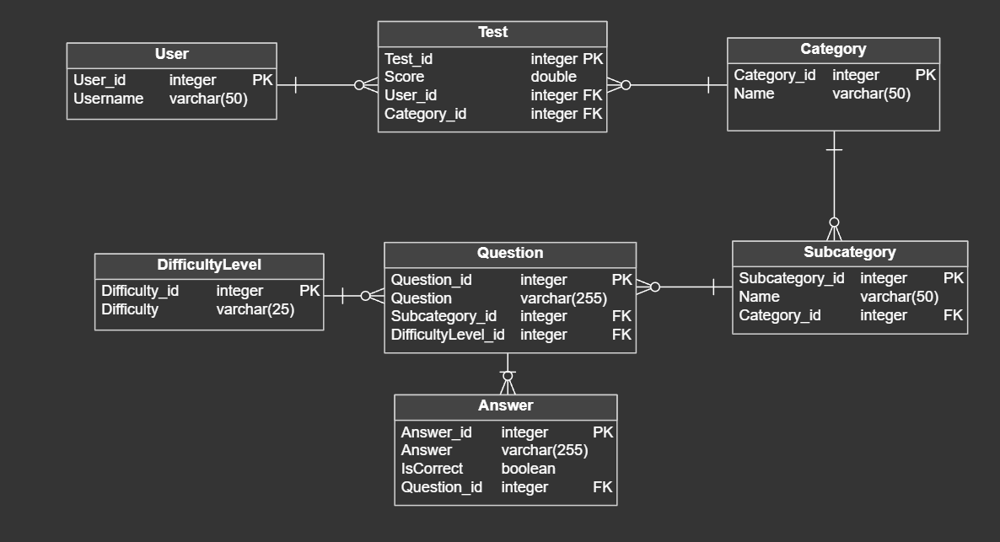
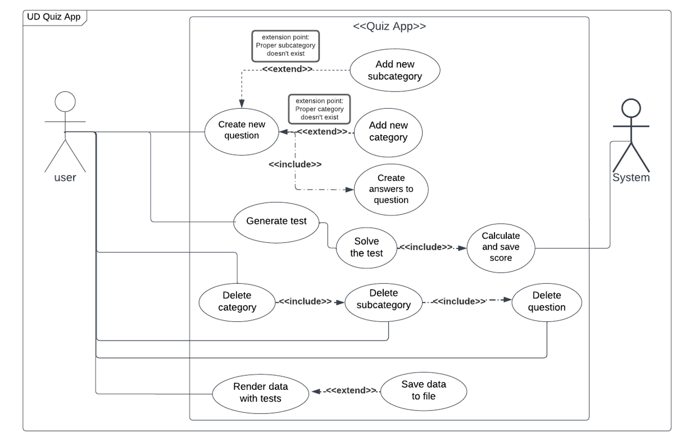
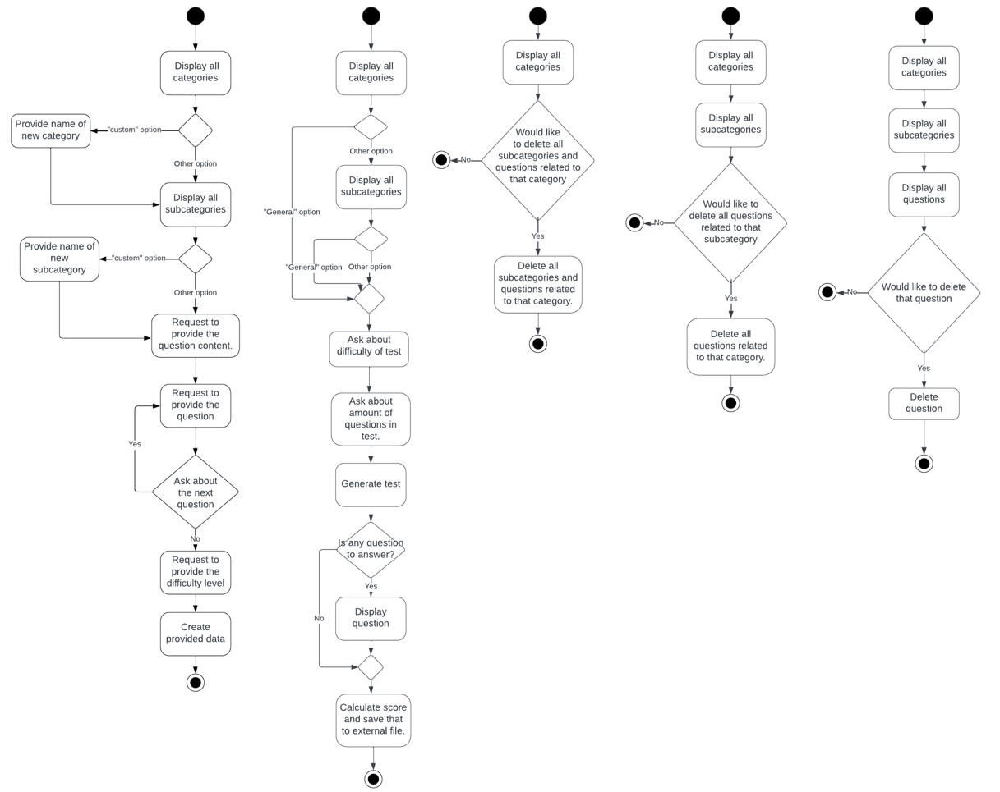

# Quiz-App
> Project for PPY course at PJATK aimed at demonstrating knowledge of basic Python language elements.

## Table of Contents
* [General Info](#general-information)
* [Technologies Used](#technologies-used)
* [Run and Test](#run-and-test)
* [Functionality](#functionality)
* [Database](#database)
* [Use case diagram](#Use-case-diagram)
* [Activity diagram](#Activity-diagram)
* [Room for Improvement](#room-for-improvement)

## General Information
This quiz application allows the user to create and generate tests based on pre-defined questions. The user can create questions, organize them into categories and subcategories, and delete them if necessary. The application stores the questions in database and generates tests randomly based on the chosen categories and subcategories.

## Technologies Used
- Python
- SQLite

## Run and Test
To use the application, the user can execute the main script quiz_app.py in their Python environment. The application will prompt the user to choose an action by selecting a number from the displayed list of options. The user can select from the following actions:
- <strong>Create a question</strong>  - by selecting option 1 and following the prompts.
- <strong>Generate a test</strong>  - by selecting option 2 and following the prompts.
- <strong>Delete a category</strong>  - by selecting option 3 and following the prompts.
- <strong>Delete a subcategory</strong>  - by selecting option 4 and following the prompts.
- <strong>Delete a question</strong>  - by selecting option 5 and following the prompts.

## Functionality
- <strong>Create a question</strong> - the user can add a question to the application specifying the category, subcategory, question text, and four possible answers.
- <strong>Generate a test</strong>  - the user can choose a category, subcategory, and the number of questions, and the application will randomly select and display the specified number of questions.
- <strong>Delete a category</strong>  - the user can remove a category and all its questions from the application.
- <strong>Delete a subcategory</strong>  - the user can remove a subcategory and all its questions from the application.
- <strong>Delete a question</strong>  - the user can remove a question from the application.

## Database

## Use case diagram

## Activity diagram 

## Room for Improvement
- Persisting the questions in a database for more permanent storage.
- Adding authentication and user management to the application.
- Providing an interface for the application to make it more accessible to users.
- Adding a feature to edit existing questions.